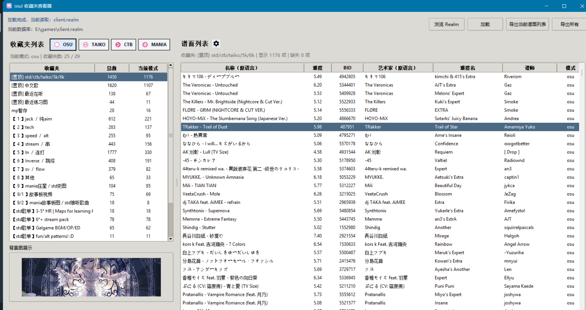
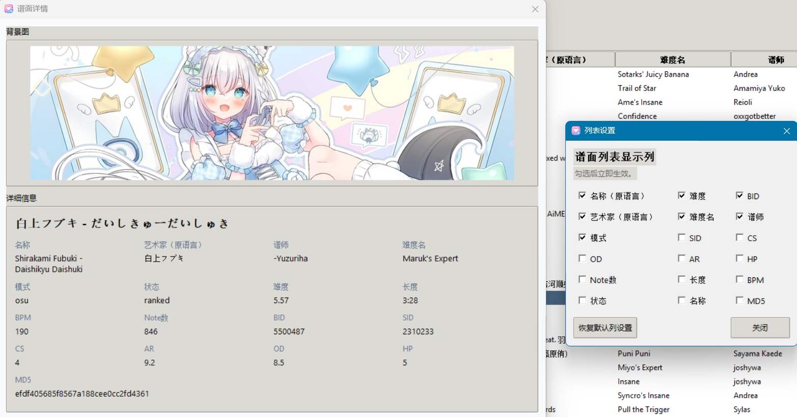

# osulazer-collection-view

一个用于查看 `osu!lazer` 收藏夹的桌面工具。（Vibe Coding）

它会读取你选择的 `.realm` 数据库文件，后台调用仓库内已经编译好的 `extractor.exe` 提取收藏夹数据到 JSON，再由 Python 图形界面展示收藏夹、谱面列表、背景图预览和详情弹窗。

下载地址：见右侧Release




## 使用说明

发布目录：

```text
dist/osulazer-collection-view/
```

使用步骤：

1. 双击 `osulazer-collection-view.exe`
2. 点击“浏览 Realm”
3. 选择你的 `client.realm` 或其他 `.realm` 数据库文件
4. 点击“加载”
5. 等待后台运行 `extractor.exe` 完成解析

说明：

- 发布版已经包含 Python 运行时
- 发布版已经包含 `extractor.exe` 和 `realm-wrappers.dll`
- 目标机器不需要额外安装 Python 或 .NET

## 运行时文件

程序运行后会生成这些内容：

- `runtime/covers/`：缓存的背景图
- `runtime/extracted.json`：当前最新的提取结果
- `runtime/ui_settings.json`：界面列设置和上次选择的 realm 路径


## 打包发布

重新打包多文件桌面版可以直接执行：

```powershell
.\build.ps1
```

打包脚本会自动完成这些事：

- 安装 / 更新 Python 打包依赖
- 检查 `extractor\extractor.exe` 和 `extractor\realm-wrappers.dll`
- 用 `PyInstaller --onedir` 打包 Python 图形界面
- 将 `assets/` 和 `extractor/` 一起打进发布目录
- 使用 `assets/logo.ico` 作为应用图标

## 开发与构建

### 目录结构

```text
osulazer-collection-view/
|-- app.py
|-- requirements.txt
|-- collection_view/           # Python 代码
|-- extractor/                 # 已编译提取器运行文件
|-- assets/                    # 模式图标、设置图标
`-- runtime/                   # 运行时生成内容
```

### 开发版启动

```powershell
pip install -r requirements.txt
python app.py
```

开发版启动后：

1. 点击“浏览 Realm”
2. 选择 `.realm` 数据库文件
3. 点击“加载”
4. 程序会直接后台运行 `extractor.exe`

### Python 环境

- Python `3.11` 或更高版本
- 建议使用虚拟环境

当前 Python 依赖：

- `Pillow`
- `openpyxl`
- `requests`

### 提取器说明

当前项目仓库内直接放置了提取器运行文件：

- [`extractor/extractor.exe`](./extractor/extractor.exe)
- [`extractor/realm-wrappers.dll`](./extractor/realm-wrappers.dll)

主程序调用方式：

```powershell
.\extractor\extractor.exe .\client.realm .\runtime\extracted.json
```

注意：

- `realm-wrappers.dll` 需要和 `extractor.exe` 放在同一目录
- 提取器以只读方式打开 `client.realm`

## 依赖版本

### Python

- Python `3.11+`
- Pillow `>=10.4.0`
- openpyxl `>=3.1.5`
- requests `>=2.32.3`

## 备注

- 背景图使用公开资源地址：
  `https://assets.ppy.sh/beatmaps/{sid}/covers/cover.jpg`
- 对于收藏夹中存在但当前本地数据库无法解析的条目，会显示为缺失项
