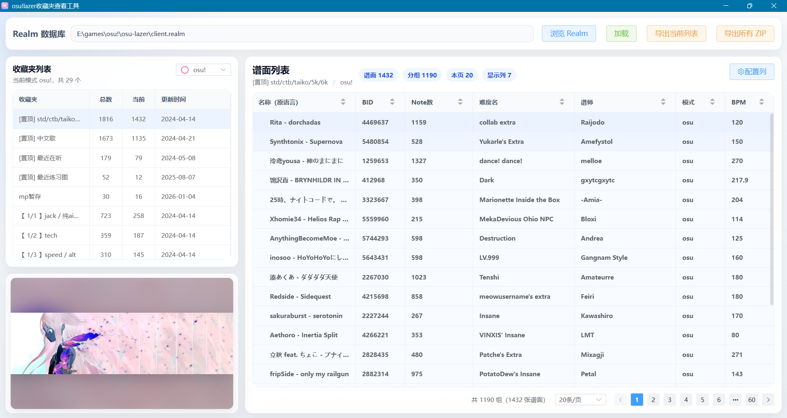
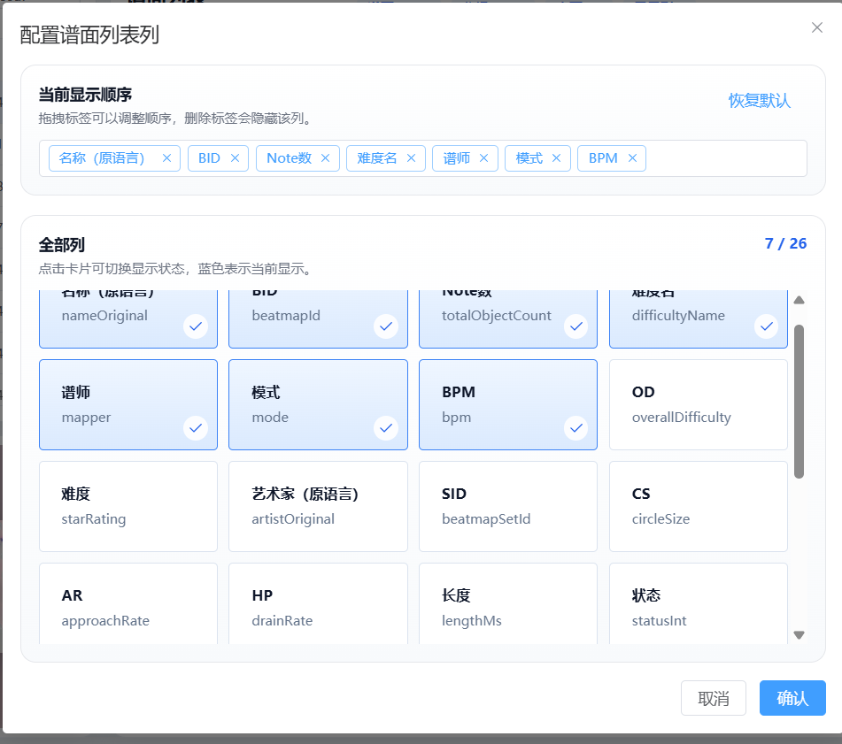
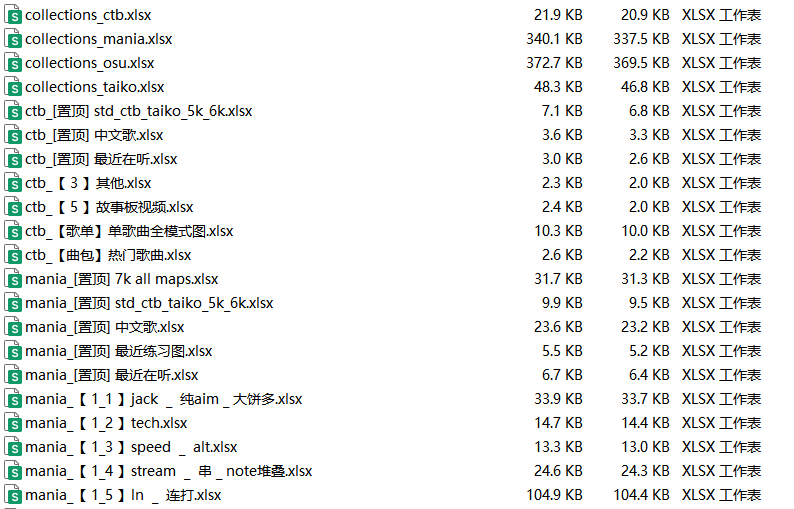

# osu!lazer 收藏夹管理工具

读取 osu!lazer 的 Realm 数据库，集中浏览、筛选、整理和导出收藏夹中的谱面。

## 功能

- 选择并加载任意 `.realm` 数据库文件。
- 浏览全部、osu!、Taiko、Catch、Mania 和缺失谱面。
- 按收藏夹查看谱面总数、当前模式数量、缺失数量和更新时间。
- 按名称、艺术家或谱师分组，支持排序、分页和缺失项统计。
- 单击预览谱面封面，双击查看完整详情。
- 自定义显示列、列顺序和每页数量，设置会自动保存。
- 将当前收藏夹和模式导出为 Excel。
- 将四个模式导出为汇总 Excel，并为每个非空收藏夹生成独立谱面表后打包为 ZIP。
- 下载、校验并缓存 osu! 封面；无法联网时仍可查看已有谱面数据。

## 界面预览







## 使用

1. 在发布页下载 Windows 便携版 `collection-view.exe`。
2. 启动程序，选择 osu!lazer 的 `.realm` 数据库文件。
3. 使用模式、收藏夹、排序和分组筛选查看谱面。
4. 通过导出功能保存当前列表或全部模式的数据。

首次加载大型数据库可能需要等待。Windows 系统需要 WebView2 运行时；程序只读数据库，不会修改 osu!lazer 的 Realm 文件。

## 本地文件

程序会在 Tauri 应用数据目录下创建 `runtime/`，保存界面设置和已校验的封面缓存。Realm 文件只会短暂复制到系统临时目录进行读取，完成后立即删除。

删除这些运行时文件只会清除缓存和本地设置，不会影响原始数据库。

## 开发者说明

本项目使用 Tauri 2、Rust、Vue 3、TypeScript、Pinia 和 Element Plus；Rust 通过 `realm-db-reader` 直接读取 Realm 数据库，并负责文件操作与导出。开发和打包需要 Node.js、npm 及 Rust stable 工具链。

```powershell
npm install
npm run tauri dev    # 开发
npm run tauri build  # 打包
```
